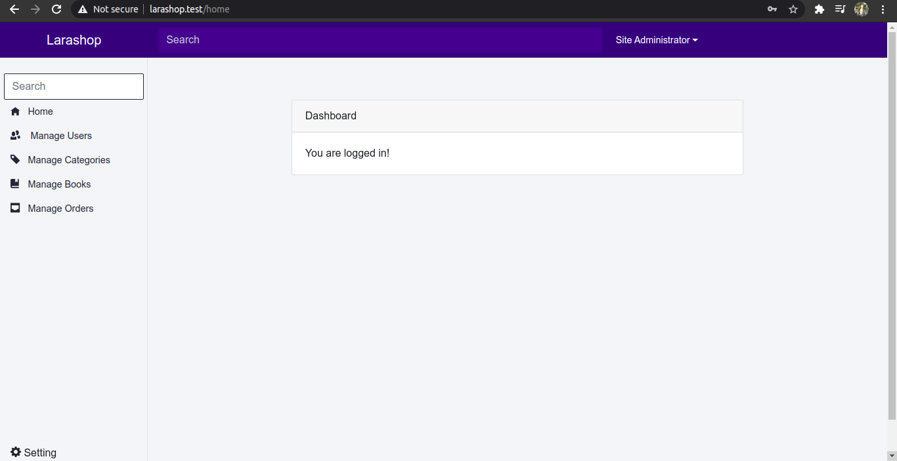

# LARASHOP

Larashop is a bookstore application. Created using the laravel 8 framework following the tutorial from Mas Azamuddin's book Be Fullstack Developer.

1. Clone this repository:

```
$ git clone https://github.com/ikhfhm/larashop.git
```

2. Go inside folder:

```
$ cd larashop
```

3. Copy file .env

-   For MacOs GNU/Linux:

```
$ cp .env.example
```

-   For Windows OS:

```
$ copy .env.example .env
```

4. Install composer:

```
$ composer install
```

5. Generate key:

```
$ php artisan key:generate
```

6. Configure database

```
DB_CONNECTION=mysql
DB_HOST=mysql
DB_PORT=3306
DB_DATABASE=<DATABASE NAME>
DB_USERNAME=<USERNAME>
DB_PASSWORD=<PASSWORD>
```

7. Migration:

```
$ php artisan migrate
```

8. Dump autoload

```
$ composer dump-autoload
```

9. Seeder migration

```
$ php artisan db:seed
```

11. Serve

```
$ php artisan serve
```

### Open Application

Open http://localhost:8000
|#|Role|email|Password|
|---|---|---|---|
|1|admin|administrator@larashop.test|larashop|

### Screenshot

Login page

Home page

Users page

Categories page

Books page

Orders page

